### Embodied-Agent Supported Environment for Learning (EASEL)

#### ===== Requirements:
- Windows 10/11 OS
- Unity Version 6.3 LTS if you opening in the inspector
- Stable internet connection
- VPNs are turned off to prevent API rate limiting
- Meta Horizon Link app
- Data cable or fast internet speed for Air link
- VR Headset (Tested with Quest Pro)
- Verify unity project file path is: `"C:/UnityProjects/EASEL"`
Should look like the following:
```
--C:/UnityProjects/EASEL/
 |- Assets
 |- Packages
 |- ProjectSettings
 |- UIElementsSchema
 |- TempAssembly.dll
```
- If filepath does not match then the agent is unable to find the whisper model to use for speech to text.


#### ===== Download instructions:
1. Take `"EASEL"` folder and drag into path: `"C:/UnityProjects/"`
- If `"UnityProjects"` doesn't exist then please create it and then drag "EASEL" into that folder
- ! It is important the path matches 100%


#### ===== Setup:
1.Open Meta Horizon Link app and enable link with Meta Quest headset via air link or data link cable.
2. Make sure VPNs are off so that the API calls are not rate limited.
3. Create an environment variable for the `INWORLD_API` key. (For demonstration purposes this has been hardcoded).
4. Create an environment variable for the `MISTRAL_API_KEY`. (For demonstration purposes this has been hardcoded).
5. Ensure sound settings have the "Headphones - Oculus Virtual Audio Device" selected for output and "Headset  Microphone - Oculus Virtual Audio Device".
6. Ready for launching.


#### ===== If playing editor version:
(Most stable)
1. Ensure you have downloaded the project files and placed them in `"C:/UnityProjects/EASEL"`
2. Add project to Unity Editor
3. Wait for editor load (may take a long time)
4. Press the play button at top center of the Unity Editor


#### ===== If playing build version:
(Crashes sometimes after Lesson 2 when using the MetaXRSimulator)
1. Ensure you have downloaded the project files and placed them in `"C:/UnityProjects/EASEL"`
2. Open `"Build 3.1"` folder
3. Run EASEL2.exe


#### ===== Examining save data
1. Use `Windows+R` to open the run panel.
2. Type `%appdata%` and hit `enter`.
3. Once in the "Roaming" directory go back into the `"AppData"` directory.
4. You should see at least 3 folders.
5. Go into `"LocalLow"`.
6. Then find `"215Exeter"` and enter that folder.
7. Enter `"EASEL2"` folder and you should see your exam data stored in there.

---

### Project Details

The aim of this project was to explore the use of embodied agents (EAs) within a Virtual Reality (VR) space. EAs are simply put, AI agents with a physical or virtual representation. Physically represented possibly as a robot on tracks like in Wall-E, or virtually as a non-playable character in a game.

By escaping the confines of textual representation we are able to create a greater feeling of immersion and emotional connection. And the reason for that is because we tend to treat something in the human form better than just plain text on a screen. However, through my research I discovered that how we replicate the humanoid form is extremely important, this is so that we do not make interactions with it unsettling. This uncomfortable feeling is derived from the 'uncanny valley' effect which is when something doesn't quite match what our experience expects. So for my EA I opted for a stylized representation over a more realistic one, incorporating facial movements which match what you would expect.

With this technology providing greater immersion and emotional connection I thought it would be useful in an education setting. As agentic AI was becoming more popular, at the time, I chose to use the experience to teach the fundamentals of agentic AI with assistance from the EA.

The research question I tried to answer was:
- What is the impact of embodied agents on learner's knowledge acquisition and cognitive load in the medium of VR when being taught agentic AI?

### Features

Overview:
- VR experience in Unity built with Meta XR SDK.
- Natural interaction with the EA through speech recognition via Whisper.
- Audio feedback from the agent via InworldTTS.
- Agent reasoning engine provided by Mistral AI.
- Embodied agent represented as a 2D avatar with facial movements.
- Interactive lessons which were adapted to a theme (food or games) that the user chose.
- Extensible lesson object which utilised Unity's Timeline module.
- Gamified learning by earning points to buy cosmetic hats.
- Quizzes after each lesson to measure understanding.

The agent and its different faces.


Lesson orb.

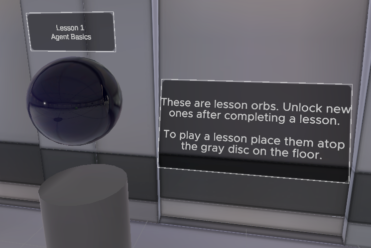

Lesson examples.

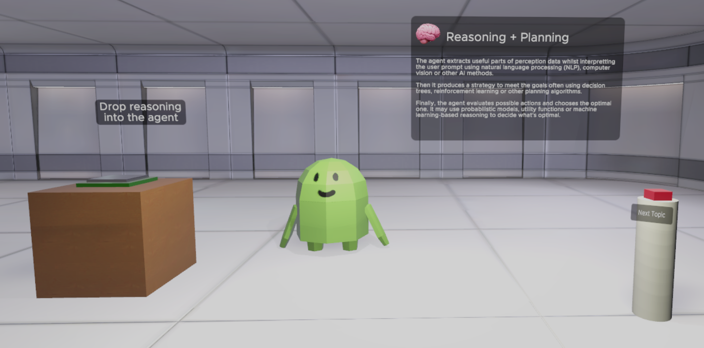
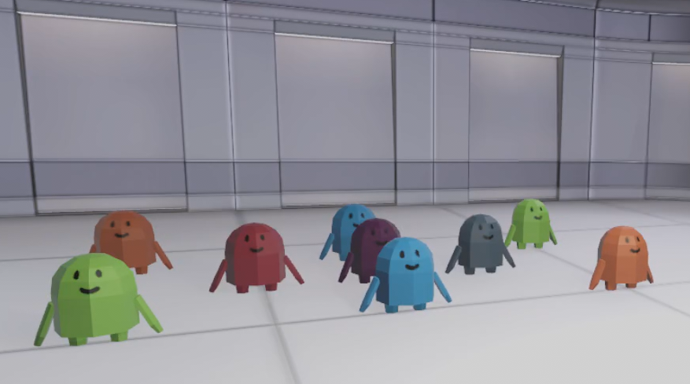

Question examples.

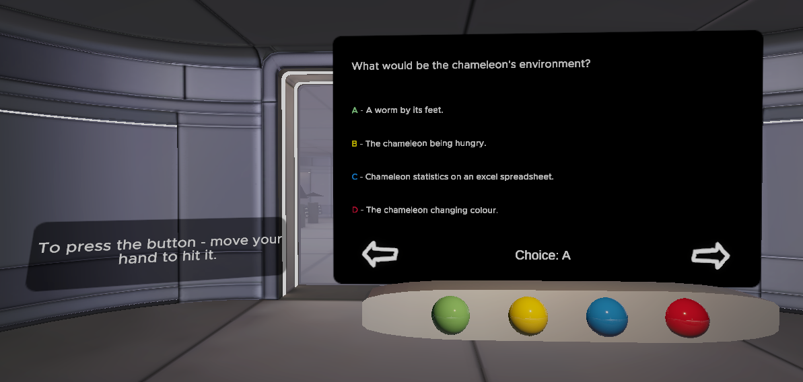
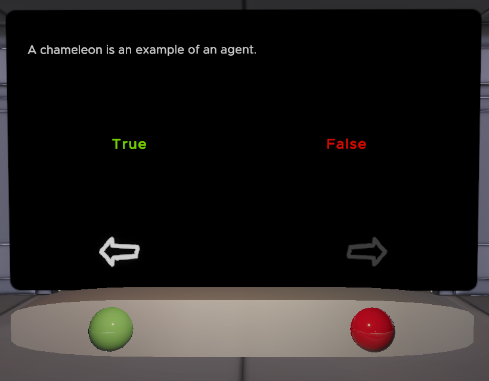

Hat shop.

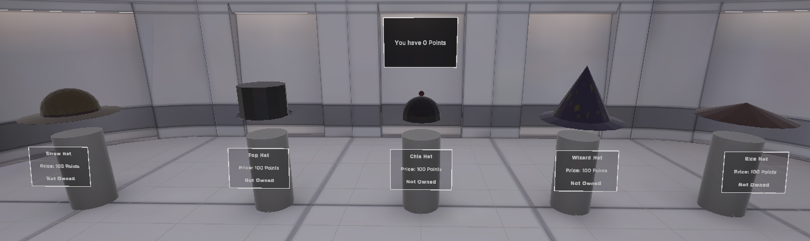

Wizard hat on robot.

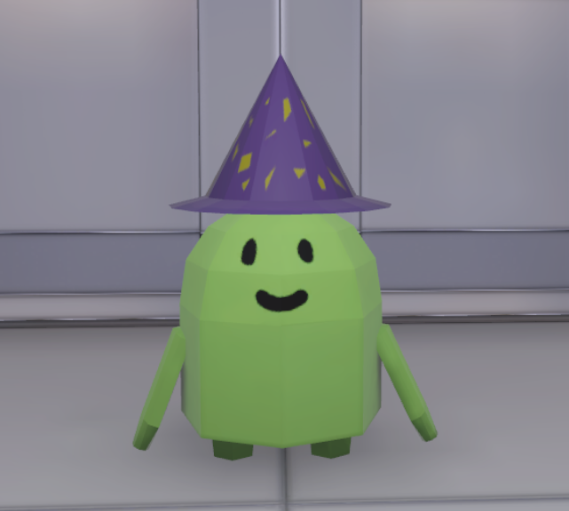

Theme select menu.

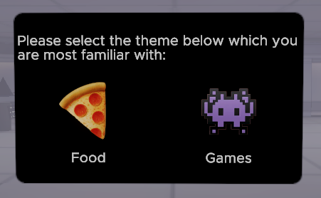

NASA Task Load Index.

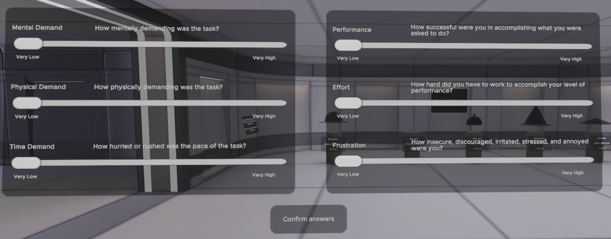

### The Creation Process

In the early stage of version 1 I focused a lot on the embodied agent system, in particular the system that would be handle the user's speech and then parse it onto the LLM so that it could generate an answer through Text-To-Speech (TTS). This is where I refactored an open source library called 'UnityNeuroSpeech', to use an API call for both Ollama and InworldTTS. The original method of calling Ollama through a windows library was conflicting with the Meta XR SDK so I changed it to use API calls to the localhost, which would greatly benefit me later on when I switched to an online service instead.

After that I was designing ways on how I could bring interactivity to the lessons, I struggled for most of the abstract lessons on how I could conceptualise the content into something the player could interact with. Most lessons used traditional powerpoint slides that the student would read or listen to. But some lessons also incorporated the use of robots. I created the robots with behaviour trees that would behave differently depending on its current equipped components, for example if it had no 'Perception' component then the robot would just walk in straight lines unless it hit something. This was used extensively when teaching students about 'Agentic Components' where I showcased how the robot would behave whenever it was missing that specific component. Though, I encountered an issue where most of the malfunctions looked the same and it was hard for the student to discern what was going wrong.

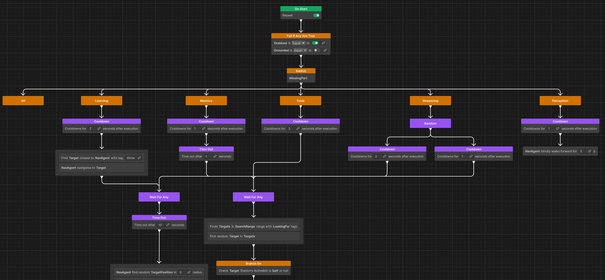

Once lesson production was done I created quiz scriptable objects where you could change which questions showed up for that quiz and in what order. With the question system, I implemented answer saving for future analysis where I could compare scores between those who experienced the lessons with EA versus those who had no EA. Version 1 suffered from long quizzes, about 20 questions long for each lesson, so by the end the player would lose interest and be frustrated. And because the level was much larger, the average frame rate was below the recommendation for a comfortable experience. Additionally, it would suffer from 2 second long stutters whenever the student asked the assistant a question.

Due to all of the shortcomings of version 1 I decided to rework it. Version one's embodied agent system was revamped to use Mistral AI instead of a locally hosted model running through Ollama, this was for 2 reasons. Reason 1 was running a model at the same time as running the game was using up too much of the system resources that it negatively impacted the experience. And reason 2 was that the local model could not handle more than 2 sentences for added context whenever answering a student's question (any additional context would just be ignored and not affect the output). In version 2, the question system from before was largerly unchanged except for the addition of a new question type. 
#### Version 2

With version 2 I wanted to change the lessons into live demonstrations, this is where I started using Unity's Timeline library in order to produce animated in-world lessons.

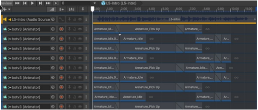

Each lessson would be made up of individual demonstrations known as 'Chapters', Chapters included animations for characters and objects that would show up. Designers can then combine Chapters into a scriptable object called the 'LessonConfig' where they specify options for chapter variations for the respective theme and the order of chapters.

In all of my lessons there existed chapters that would vary depending on the theme, which was chosen by the user in the beginning. The rational behind this was to provide a familiar setting for explaining the topic, this would change the analogies in the narration and the objects in the demonstration.

These 3 systems would make up version 2 which is EASEL.

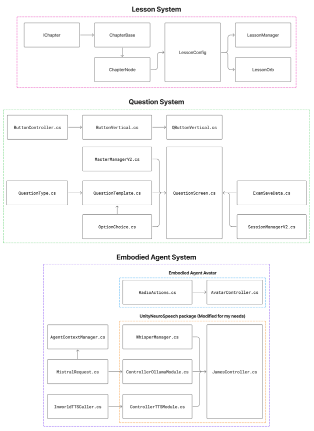

### Improvements
- Using user-defined file path instead of mandatory provided one.
- Stability issues - Build and editor versions crashing sometimes after multiple plays.
- Speech recognition did not work in a loud room.
- Increasing agent context was not effective after the 3rd lesson.
